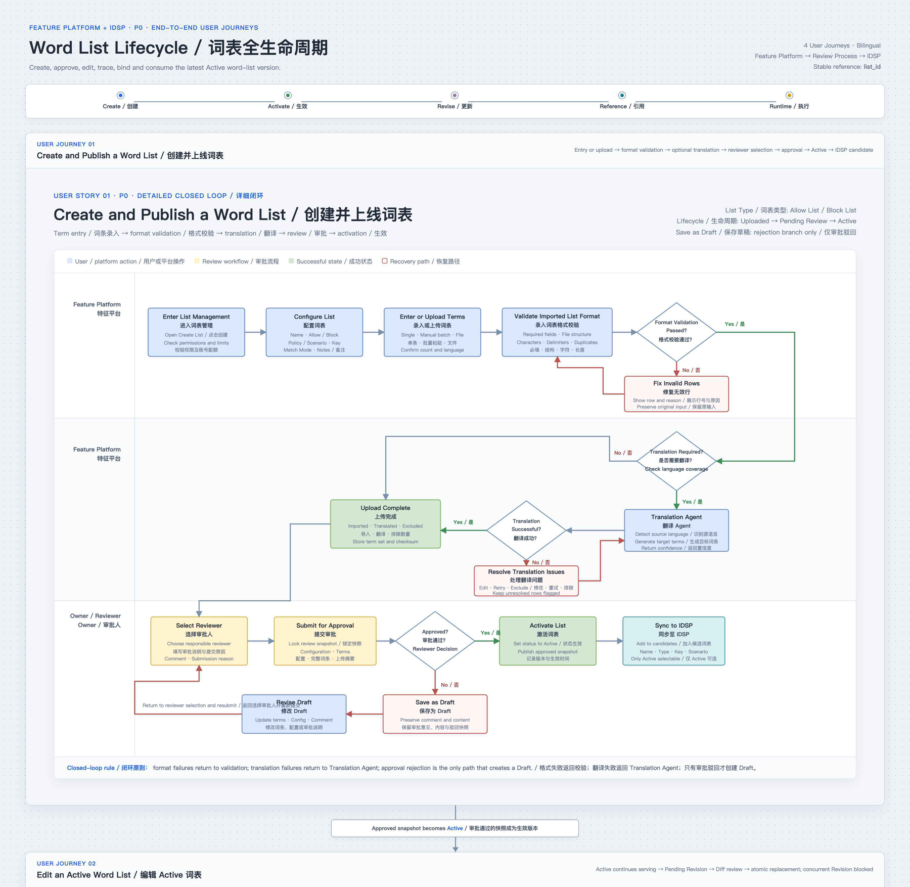
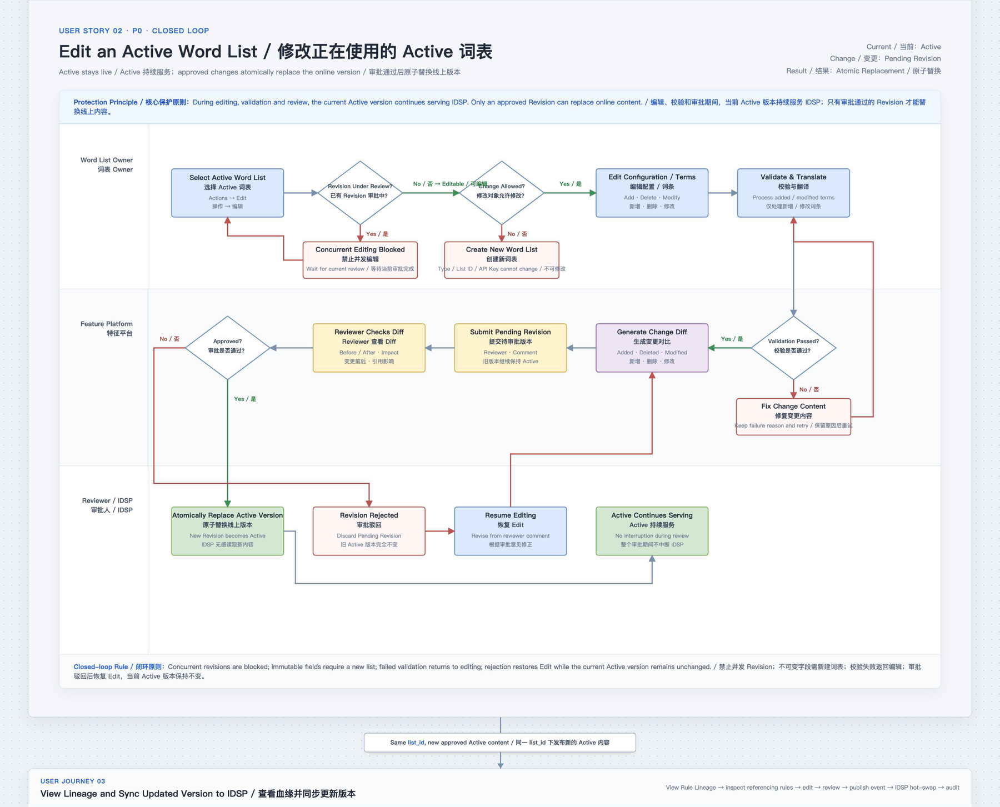
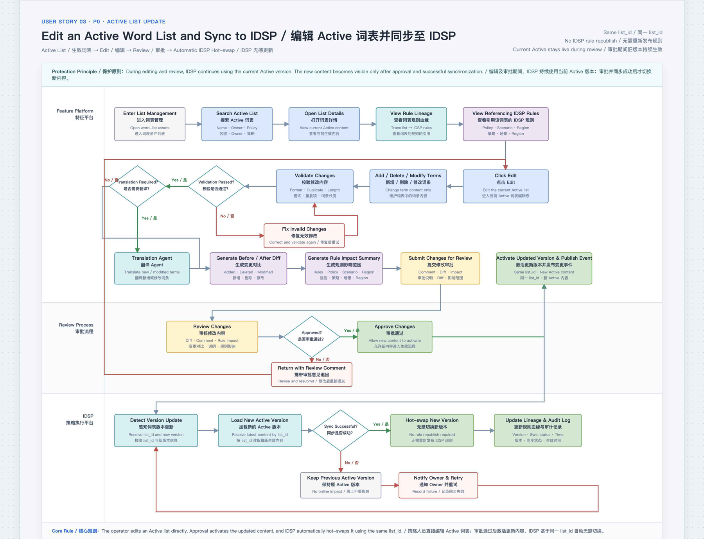
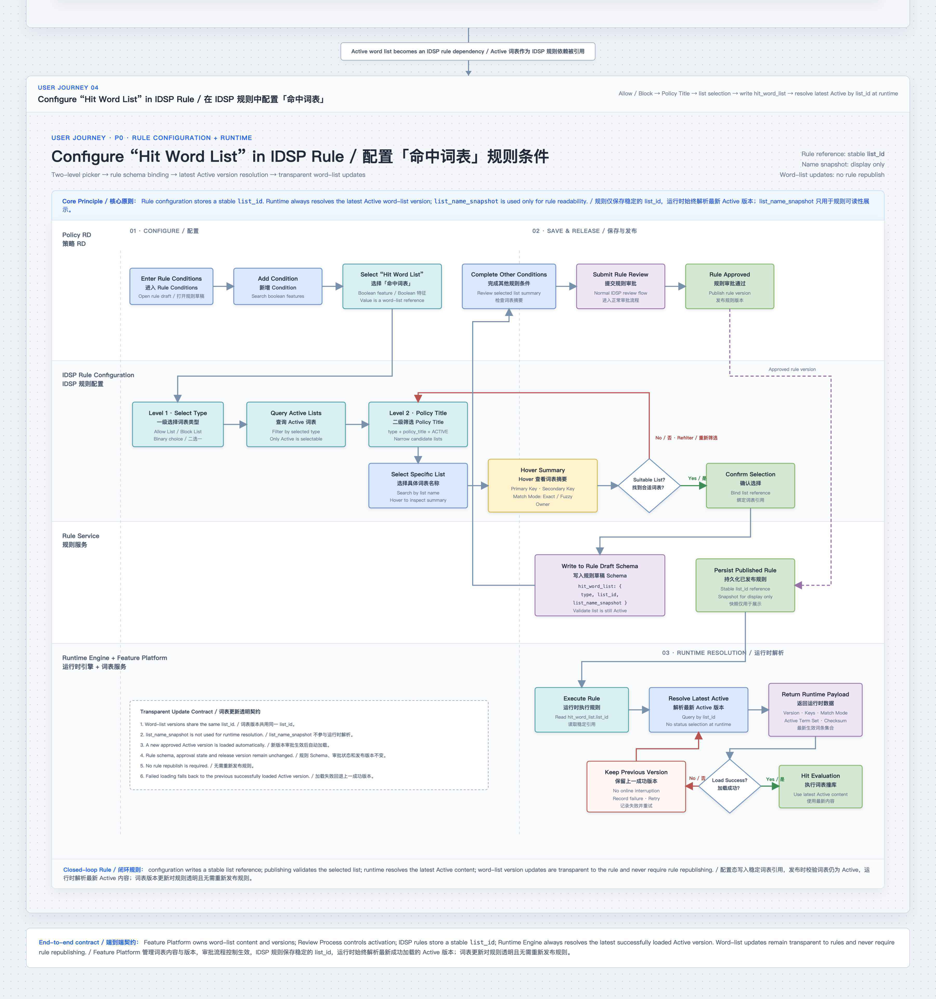

# Feature Platform · Word List Lifecycle

Word lists are the terms a moderation rule matches against. This is their full lifecycle —
creation, translation, approval, versioning, reference from strategy rules, and hit traceback —
designed so **unapproved content can never reach production** and **an old version keeps serving
while a new one is under review**.

**PRD source:** [`Word List Lifecycle PRD.html`](https://htmlpreview.github.io/?https://github.com/yg674-dev/feature-platform-word-list/blob/main/Word%20List%20Lifecycle%20PRD.html)
(bilingual screenshot PRD, updated 07/21/2026) · **Prototypes:** see [What's in this repo](#12-whats-in-this-repo)

This README is the PRD in full, in English.

---

## 1. Business goal

Moderation policy moves at the speed of its word lists. The business needs those lists to change
quickly across 16 languages and many markets — without a deploy, without taking the current policy
offline, and without losing the ability to explain afterwards why a specific piece of content was
caught.

The goal is to make word lists **safe to change fast**. Three guarantees carry that, and every
design decision below follows from them:

- **Unapproved content never reaches production.**
- **The current Active version keeps serving while a new one is under review.**
- **Every enforcement decision stays reconstructible** against the exact version that ran, not
  whatever is Active today.

Why this is risky without them: a word list is the set of terms a moderation rule matches against,
so editing one silently changes what production blocks — across every rule that references it, in
every market, with no deploy. The danger is not that the terms are wrong; it is that nobody can see
the blast radius before the change lands, or reconstruct afterwards what caught a given piece of
content.

Five user journeys: **Create** · **Edit Active** · **Query / Lineage** · **IDSP Picker** ·
**Trace Hit Explainability**.

The 07/21 revision adds Feature Original Value, multiple hit-list tabs, multilingual hit panels,
and English-gloss hover to Trace. Journey 4 keeps the one-condition-one-list configuration rule.

## 2. Key decisions

These are the six calls that shape everything else — most of them are **deletions**.

1. **Language mode, not market.** Creation is configured as *Single language* / *Multiple
   languages*. Single-market / multi-market is no longer the primary UI split.
2. **List Attribute replaces list-kind.** *Allow list* / *Block list* categories and the abstract
   list-kind feature are **removed**. IDSP expresses the same intent with
   `is_hit_list` / `is_not_hit_list` + Data Source + `in` / `not in` + the Active Word List Picker.
   Whether a list permits or blocks is a property of how the rule uses it, not of the list.
3. **List ID replaces API Key.** One external reference field, stable across versions.
4. **Approval safety is structural.** Unapproved content never enters IDSP. The old Active version
   keeps serving throughout an edit. After approval, IDSP picks up the latest Active automatically —
   no rule republish.
5. **List Family → Versions.** The catalog groups by List Name into a family. Expanding a family
   shows its Active, Pending Review, Draft, and Archive versions. **The family row is asset-level;
   sub-rows are version-level** — approval and deletion never happen at family level.
6. **List ID is version-level.** The family row shows the current Active version's ID, and **only
   Active IDs are copyable**. Non-Active IDs are audit-only and cannot be newly referenced.

## 3. Scope

| Platform | Scope | Priority |
| --- | --- | --- |
| **Feature Platform** | Family-grouped list management, version expansion, Language filter, Create Wizard, Details, Active Inline Edit, Lineage, orphan-aware Archive blocker | **P0** |
| **Review Process** | Owner submit, reviewer diff, approve / reject, rejection-only Draft, version-level audit trail | **P0** |
| **IDSP** | List Attribute (`is_hit_list` / `is_not_hit_list`), per-condition Data Source, `in` / `not in`, flat Active-only Word List Picker, stable `list_id` schema, atomic Active pointer switch | **P0** |
| **IDSP Trace** | Configured vs. Actual Hit, Feature Original Value, multiple hit-list tabs, hit-language panels, English-gloss hover, condition hit flow | **P0** |

## 4. Match modes

| Mode | Definition | When to use |
| --- | --- | --- |
| **Exact Match** | Hits only when the checked text contains a continuous substring **character-identical** to a term. Implementable with Aho-Corasick or hash table + sliding window — O(n), zero tolerance | High-confidence keywords, low false-positive tolerance, and rule conditions that need a stable, explainable outcome |
| **Fuzzy Match** | Hits when edit distance between the text and a term is within a threshold. Implementable with Trie + edit-distance pruning, or a BK-tree | Adversarial variation — deliberate misspellings, repeated characters, OCR errors |

## 5. Lifecycle states

| Status | Meaning | Available action | Next |
| --- | --- | --- | --- |
| **draft** | Auto-saved after a rejection. **Not referenceable by IDSP** | Keep editing terms, add context, fix errors | Resubmit for review |
| **Pending Review** | Submitted, awaiting decision | **Not editable** — content under review must not move | Await approve / reject |
| **Active** | Approved and online; the List ID is referenceable | View Details / Lineage; edit through Pending Revision | Archive only when **Active Refs = 0**; otherwise release references first |
| **Archive** | Archived, excluded from the IDSP picker | Owner can restore to draft, or delete | A restored list re-enters review |

## 6. Catalog data model

| Level | Displays | Rules |
| --- | --- | --- |
| **List Family** *(main row)* | List Name, current Active List ID, version count, Owner, Terms, Language | One evolving asset. Its status dot only indicates **whether an Active version exists**. Approval and deletion are never family-level |
| **Version** *(sub-row)* | Version status, List ID, Owner, Terms, Language, Actions | Details / Edit / Review / Archive / Delete all act on a **specific version**. Only the Active version's ID is copyable |
| **Family with no Active** | Gray dot, no copyable ID | May hold Pending Review, Draft, or Archive versions, but **stays out of the IDSP Picker** until a version is approved |
| **Language filter** | All, plus `en · es · id · ar · vi · th · ms · tr · fil · ja · fr · de · ro · it · pt · ko` | Combines with Status, Ownership, and Keyword using **AND**, applied on Search. Reset restores defaults |

## 7. User journey

Four end-to-end journeys, from creating a list to a rule resolving it at runtime.

### Journey 1 · Create and publish a word list



### Journey 2 · Edit an Active word list



### Journey 3 · View lineage and sync the updated version to IDSP



### Journey 4 · Configure a hit-word-list rule condition



> **This diagram predates the 07/21 revision.** It still shows the **two-level picker**
> (Level 1 Allow List / Block List → Level 2 Policy Title) and an API Key. Both were removed: the
> picker is now flat and Active-only, and allow/block is expressed by the rule through
> `is_hit_list` / `is_not_hit_list` + Data Source + `in` / `not in`. The runtime half — stable
> `list_id`, latest-Active resolution, no rule republish, fall back to the last successfully loaded
> version — is current, and is the contract in §13.

## 8. Journey 1 · Create a word list

`List Management → Create List → Basics → Single/Multiple language → Import & Translate → Confirm → Select Reviewer → Review → Active`

1. **List Management entry.** All list assets and lifecycle states in one table. Filters (Status,
   Ownership, keyword, Match Mode) are **explicitly applied on Search**, combined with AND; Reset
   returns to default. Families expand into versions via ▸.
2. **Step 1 · Basics.** List Name, Policy Title / Business Scenario, Match Mode, Primary Key,
   Secondary Key. Language is *Single* or *Multiple* — Single goes straight to import confirmation,
   Multiple routes through Translate Agent. **No Allow/Block choice.** The system generates the
   List ID here; it is the stable reference for Details, Review, and the IDSP schema thereafter.
3. **Step 2 · Import.** Download the Lark Table template, fill, upload — **max 2,000 rows**.
   The system validates columns, required fields, characters, duplicates, length, and accepted
   languages, showing failed rows inline. **Partial import is not accepted**: every row must pass.
   Over the cap, the upload is rejected with re-upload guidance.
4. **Translate Agent.** One primary entry — the user explicitly clicks *Translate Now* after
   confirming source terms. Running detects source language, translates to English, and computes
   completion. Complete / Issues reports success, failure, and unusable counts — **not word-by-word
   output**. Two error cases: *Missing value* (empty translation) → row-level prompt, fill or Skip;
   *Untranslatable* (language outside accepted inputs, e.g. `zh-TW`) → Skip, or return to Step 1 and
   add the language.
5. **Step 3 · Confirm.** Final terms, dedupe result, language distribution, translation breakdown,
   final configuration. Confirm completes the upload — **but the content is not Active yet**.
6. **Upload complete.** The system locks configuration, terms, and the upload summary.
   **Normal creation produces no draft** — draft exists only as the result of a rejection.
7. **Owner submit.** Owner checks List ID, Match Mode, term count, Translate Agent result, and
   permissions, then picks a Reviewer and adds context. **The submitter cannot review their own
   list.** Status → Pending Review, with a Lark notification.
8. **Reviewer review.** Submitter, configuration snapshot, Owner comment, and the full term list.
   Approve or Reject.
9. **Reject → draft.** A reason is mandatory. A rejected initial creation auto-saves as draft.
10. **Approve → Active.** Approval makes the list Active **directly** — no separate Publish click.
    It then enters the referenceable set for Feature Platform and IDSP.

## 9. Journey 2 · Edit an Active word list

`Active → Edit → Add / Delete / Modify → Validate changed terms → Select Reviewer → Review → new Active, or the current Active stands`

- **The Active version never stops serving.** Editing an Active list creates an **isolated Pending
  Revision**. The row stays Active with a *Changes Pending Review* indicator; Edit and Archive are
  temporarily disabled to prevent concurrent modification.
- **Re-import or paste.** Revisions accept Lark Table / CSV re-import and Manual Paste.
- **Change is visible before submission.** Added, removed, and modified terms are color-coded with
  `+ / − / ~` counts, so the Owner understands the change scope before submitting.
- **Submit shows blast radius.** The submission modal reports Added / Removed / Modified counts and
  **Rules Affected**; the Owner confirms these explicitly.
- **Reviewer sees a diff** — current Active on the left, proposed version on the right.
- **A rejected revision changes nothing.** The current Active remains untouched.

## 10. Journey 3 · Query, details, and lineage

- **Details modal** — List ID, Match Mode, Owner, update time, status, and **Active Refs**.
- **Full details page** via *View Configuration*.
- **Language coverage** — language, term count, translation rate, and average translation
  completion, ordered by business priority.
- **Lineage drawer**, opened from Active Refs, summarizing **Rule Group References, Active Nodes,
  and Active Canvases** — the rules that would break if this list changed.
- **Archive is blocked while `Active Refs > 0`.** A list still referenced by online rules cannot be
  archived; references must be released first. This is the orphan-aware blocker.

## 11. Journey 4 · IDSP word list picker

**Rule context stays visible, but stops being a navigation hierarchy.** Business Scenario, Policy,
Canvas, and Rule Group are shown as context — they are no longer category levels inside the Picker.

1. **Condition entry.** In IDSP *Edit Rule → Conditions*, the Feature dropdown is grouped into
   **List Attribute**, Room Attributes, Model Predictions, Policy / Punish Signals, and User Behavior.
2. **Data Source is single-select** and determines which text field the condition checks.
3. **Operator `in` / `not in`** turns Value into the unified Word List Picker; other operators keep
   their normal value input.
4. **The picker contains Active lists only** — never Draft, Pending Review, or Archive. Select
   Policy Title first to narrow scope; hover a list to inspect Primary Key, Secondary Key, and
   Match Mode.
5. **One condition references one list.** Selection renders as a single removable pill and is
   preserved on reopen. **Multiple lists are modeled as multiple conditions plus a Logical
   Expression** — not as a multi-select.
6. **Schema:** `condition.value = { list_id, list_name_snapshot }`. There is **no type field** for
   Allow/Block.

## 12. Journey 5 · Trace a word list hit

The question Trace answers: *this rule fired — on which term, in which language, from which list,
against which raw value?*

- **Configured vs. Actual Hit.** From the IDSP Data Report, opening a *Hit + Effective* rule shows
  Conditions, the Logical Expression, and the final Action — separating what was **configured** from
  what actually **hit**.
- **Feature Original Value comes first.** The drawer leads with Feature · Data Source and the
  **Original Value** — the raw value the feature read *at Trace execution time*. Explicitly **not**
  Input Language and **not** Source Language.
- **Multiple hit-list tabs.** When several lists hit, each gets a tab.
- **Only real hits are rendered.** Within a selected list, panels appear only for languages that
  actually hit; non-hit languages are omitted. Matched terms carry an optional **English gloss** on
  hover.

## 13. Backend contract

| Area | Requirement |
| --- | --- |
| **Lifecycle** | Pending Review → Approve = **Active**; → Reject = **draft**. An Active edit creates an isolated Pending Revision; a rejected revision leaves the current Active unchanged |
| **Catalog** | List Family is the stable asset-level grouping; every version keeps its own status and audit record. The family row resolves the current Active version. **A family without an Active version must not expose a copyable ID or enter IDSP candidates** |
| **IDSP sync** | IDSP consumes **Active lists only**. Rules store the stable List ID and read the latest Active automatically — **no rule republish after a word-list update** |
| **IDSP condition** | A word-list condition persists List Attribute (`is_hit_list` / `is_not_hit_list`), one Data Source ID, the operator (`in` / `not in`), and one selected Active list |
| **Schema** | `condition.value = { list_id, list_name_snapshot }`. No Allow/Block type field. The backend validates that the submitted list is Active and that the Data Source is supported by the selected List Attribute |
| **Picker empty state** | Show *No matching Active lists in scope* with *Clear filters* and *Open List Management*. **Never fall back** to Draft / Pending Review / Archive results |
| **Trace contract** | One condition-scoped object: `feature`, `ds_code`, ordered `original_value[]`, and `hit_lists[]`. Each hit-list carries `list_id`, `list_name`, `active_version_id_at_execution`, and hit-language groups; each group carries `lang`, `code`, and term rows with `term`, optional English gloss `en`, and boolean `hit`. Only actually-hit lists and languages enter the response — though term context within a hit language may include non-hit rows for inspection |
| **Trace version resolution** | Historical Trace **must resolve `active_version_id_at_execution`, never the current Active pointer**. Original value, hit lists, language groups, matched terms, and glosses stay reproducible after later list updates |
| **Trace empty / error states** | Configured list did not hit → empty `hit_lists`, Configured still visible in the Data Report. Empty original value → inline *No source value captured*. Recorded version unavailable → *Explanation unavailable* with Trace ID, Data Source, and List ID. **Never silently fall back to current Active content** |
| **Validation** | Required columns, format, duplicates, length, accepted languages, self-review blocker, required Data Source, supported operator, Active-list status. Upload failures return row-level errors |

## 14. What's in this repo

| Source | What it is |
| --- | --- |
| [`docs/List-Management-PRD.pdf`](docs/List-Management-PRD.pdf) | The List Management PRD deck — journey diagrams and UI screens. Predates the 07/21 revision on the picker and API Key; see the note in Journey 4 |
| [`Word List Lifecycle PRD.html`](https://htmlpreview.github.io/?https://github.com/yg674-dev/feature-platform-word-list/blob/main/Word%20List%20Lifecycle%20PRD.html) | The current bilingual PRD, updated 07/21/2026 |

### Main flow

| Prototype | Covers | Version | Date |
| --- | --- | --- | --- |
| [F1 · List management](https://htmlpreview.github.io/?https://github.com/yg674-dev/feature-platform-word-list/blob/main/feature-platform-word-list-prototype-v0.3.html) | Family-grouped catalog, version expansion, filters | v0.3 | 2025-07-31 |
| [E2 · Create / edit wizard](https://htmlpreview.github.io/?https://github.com/yg674-dev/feature-platform-word-list/blob/main/feature-platform-word-list-prototype-v0.3-E2.html) | The 3-step wizard | v0.3 | 2025-07-14 |
| [E3 · Bulk import](https://htmlpreview.github.io/?https://github.com/yg674-dev/feature-platform-word-list/blob/main/feature-platform-word-list-prototype-v0.3-E3.html) | CSV / paste upload and validation | v0.3 | 2025-06-24 |
| [F3 · Reference lineage](https://htmlpreview.github.io/?https://github.com/yg674-dev/feature-platform-word-list/blob/main/feature-platform-word-list-prototype-v0.3-F3.html) | Rule groups, nodes, canvases referencing a list | v0.3 | 2025-06-25 |
| [G1 · Effect monitoring](https://htmlpreview.github.io/?https://github.com/yg674-dev/feature-platform-word-list/blob/main/feature-platform-word-list-prototype-v0.3-G1.html) | Hit metrics panel | v0.3 | 2025-07-17 |

### Approval, from three sides

| Prototype | Perspective | Version | Date |
| --- | --- | --- | --- |
| [Owner view](https://htmlpreview.github.io/?https://github.com/yg674-dev/feature-platform-word-list/blob/main/feature-platform-word-list-approval-owner-v0.1.html) | Submitting a list for review | v0.1 | 2025-06-25 |
| [Reviewer view](https://htmlpreview.github.io/?https://github.com/yg674-dev/feature-platform-word-list/blob/main/feature-platform-word-list-approval-reviewer-v0.1.html) | Reviewing the diff and deciding | v0.1 | 2025-07-14 |
| [Ticket overview](https://htmlpreview.github.io/?https://github.com/yg674-dev/feature-platform-word-list/blob/main/feature-platform-word-list-approval-prototype-v0.1.html) | The approval flow end to end | v0.1 | 2025-06-23 |

### Traceback

| Prototype | Covers | Version | Date |
| --- | --- | --- | --- |
| [Trace Hit](https://htmlpreview.github.io/?https://github.com/yg674-dev/feature-platform-word-list/blob/main/feature-platform-word-list-trace-hit-v0.1.html) | Single-hit traceback with original value and language panels | v0.1 | 2025-07-21 |

```bash
git clone https://github.com/yg674-dev/feature-platform-word-list.git
cd feature-platform-word-list
open feature-platform-word-list-prototype-v0.3.html
```

Self-contained HTML — no build step, no server.
